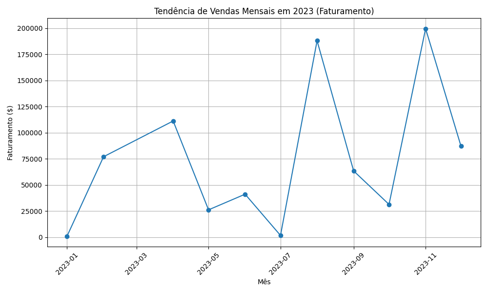

# Teste para Estagiário de Analytics Quod

## Guilherme Tuchanski Rocha

# 📊 Análise de Dados

## 1. Produto com maior faturamento

- O notebook é o produto que lidera com vendas totais (R$ 445.500,00)
- Logo vem o Computador Gamer (R$231.000,00) e a RTX 2070 (R$ 128.800,00)

É evidente que os produtos de alto valor são os principais responsáveis pelo faturamento,
mesmo que não sejam necessariamente os mais vendidos no quesito quantidade.

Portanto: O mix de vendas é dominado pelos itens caros, ou seja, poucas unidades já representam
muito dinheiro.

---

## 2. Produto com maior quantidade vendida

- O notebook também lidera no topo com 99 unidades vendidas.
- Depois, temos o Café Pelé (98 unidades) e o Headset Logitech (95 unidades)

Portanto: Produtos mais baratos vendem quase a mesma coisa que o notebook no quesito quantidade, mas faturam bem menos.
Itens de consumo são fortes na venda, mas a margem/faturamento vem predominantemente dos eletrônicos.

---

## 3. Quantidade vs Faturamento

- Café Pelé: quase 100 unidades vendidas, mas R$1470.00 de receita.
- Notebook: também quase 100 unidades, mas R$445.500,00 de receita. (!)

Portanto: Eletrônicos caros são essenciais para o resultado financeiro. Mas os produtos mais baratos ajudam a dar giro
no estoque.

---

## 4. O notebook

É evidente que o notebook é muito popular, apesar de ser caro.

---

## 5. Insights Finais da Análise 1

### 5.1. Diversificação

A empresa depende muito dos eletrônicos, em especial do notebook. Uma queda na demanda traria um grande impacto.

### 5.2. Estratégia de preços

Produtos de consumo, apesar de não serem muito impactantes no faturamento, podem ser úteis
para fidelizar clientes.

### 5.3. Promoções

Vale a pena oferecer descontos em produtos mais baratos, para aumentar o fluxo de clientes na loja,
já que isso por consequência aumentaria a exposição dos produtos que de fato impactam o resultado financeiro da empresa.

---

## 6. Gráfico de Tendência de Vendas ao Longo do Tempo

Nesse caso, poderiamos avaliar também pela métrica de quantidade de produtos vendidos
por mês. Aqui, escolhi o faturamento para uma análise mais completa do desempenho mensal.

### 6.1. Oscilação

Janeiro e Julho praticamente zerados, portanto são meses de desempenho financeiro extremamente baixos.
Porém, em Agosto e Novembro a receita explodiu.

### 6.2. Picos

Agosto e Novembro são os meses com maior faturamento.

Em Novembro ocorre a Black Friday, que pode ter relação com o aumento expressivo de faturamento,
dado que o que efetivamente traz resultados expressivos são os produtos de valor mais elevado.

Em Agosto pode ser algum tipo de campanha/promoção específico da loja, que novamente oferte
preços mais chamativos para os produtos de alto valor.

### 6.3. Produtos Caros

O gráfico evidencia quedas muito bruscas quando os eletrônicos de alto valor não são vendidos expressivamente.
É evidente que os produtos consumo recorrente / baratos vendem em quantidade, mas não conseguem sustentar
o faturamento sozinhos.

### 6.4. Insights Estratégicos

- A empresa é MUITO dependente de meses específicos (Agosto e Novembro). Essa dependência é um risco se, por exemplo,
  não tiver estoque o suficiente dos eletrônicos nesses meses.

- Baixa consistência mensal: falta de planejamento ou eventos pontuais.

- Oportunidade: Seria interessante a empresa criar promoções também em meses considerados fracos.
